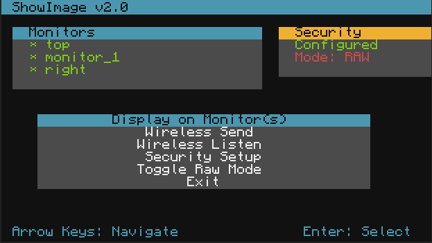
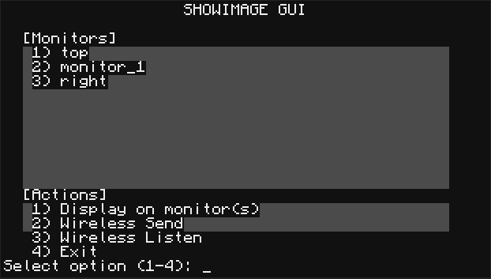

# Showimage  

Showimage.lua lets you show NFP images on screens and wirelessly control any computer running it — all backed by some of the strongest encryption you'll ever see. ^_^  




## Installation

### Latest release

Use this command to download the newest version, ShowImage_V2.lua:

```bash
wget https://raw.githubusercontent.com/GLICHED-HACKER/Showimage/main/ShowImage_V2.lua
```
### Older release

Use this command to download the original version, ShowImage.lua:

```bash
wget https://raw.githubusercontent.com/GLICHED-HACKER/Showimage/main/ShowImage.lua
```

## Documentation
Consult [the Wiki](https://github.com/GLICHED-HACKER/Showimage/wiki) for more details on how it works and how to use it.
